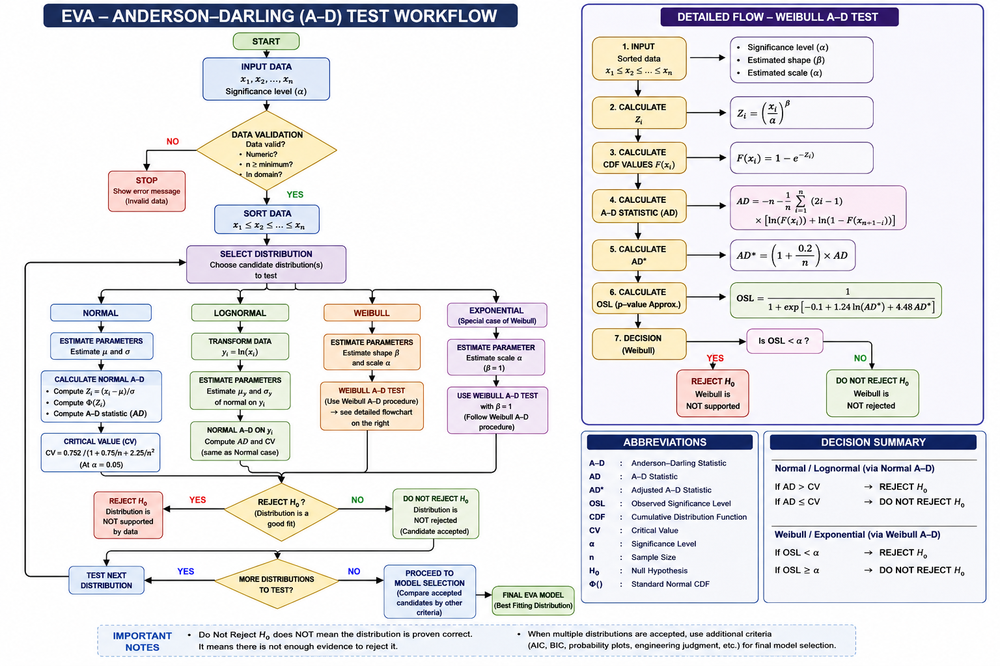

**EVA (Extreme value analysis):**

AD (Anderson darling) Goodness of FIT test for small samples and applies it to Normal, Lognormal, Weibull, and Exponential distributions.

Note: **the paper is not presenting one universal AD formula that we can blindly apply to every distribution. It uses a Normal-specific AD formulation and a different Weibull formulation.**

**Problem:**

Suppose we receives data:

12.4

15.2

18.7

...

If want to fit a probability distribution to that data.

But we have distribution methods:

For example:

Data → Weibull distribution

or

Data → Gumbel distribution

or

Data → Normal distribution (You have used distribution method from above and runed the EVA and got a result or probability)

But the dangerous part is **assuming that distribution** without checking it.

What if your assumed distribution is wrong, subsequent confidence intervals and hypothesis tests can become invalid. Therefore, the distribution assumption needs to be checked.

So, in EVA, The AD (Anderson darling) feature essentially helps us to solve this problem by below statement:

**"Does my observed sample provide enough evidence to reject the distribution I am proposing?"**

That is the role of the A-D test.

Core Work procedure: **Assume distribution → estimate parameters → calculate theoretical CDF → compare against empirical CDF → calculate AD → make a statistical decision.**

