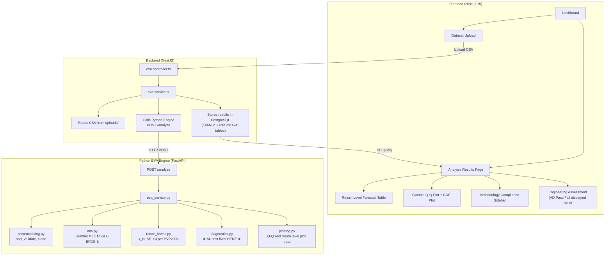

# Anderson-Darling (AD) Goodness-of-Fit Testing — Implementation Plan

## Background & Problem Statement

The EVA (Extreme Value Analysis) application currently uses the **Gumbel distribution** to model extreme corrosion wall loss in heat exchangers (per PVP2006/ASTM E2283). But how do we *know* the Gumbel is the right fit for a given dataset?

**The dangerous part is assuming a distribution without checking it.** If the assumed distribution is wrong, all subsequent confidence intervals, return levels, and end-of-life predictions become unreliable.

The **Anderson-Darling (AD) Goodness-of-Fit test** answers the question:

> *"Does my observed sample provide enough evidence to reject the Gumbel distribution I am proposing?"*

The AD test is specifically chosen because:
- It **emphasizes tail discrepancies** (weight function ψ(u) = 1/[u(1-u)]) — critical for extreme value analysis where the tails are what matter most
- The 2012 Gumbel GoF comparative study proves **AD is the most powerful GoF test for Gumbel distribution** among 6 competitors (AD, B², CVM, ZAD, ZCVM, Lₙ)
- It works well with **small samples** (n ≥ 5), which is the typical inspection scenario

---

## Overall Application Architecture

Before diving into the AD changes, here's how the entire system fits together:



### Data Flow for AD Testing
1. User uploads inspection data (CSV of wall loss values)
2. Backend sends data to Python engine (`POST /analyze`)
3. Engine: preprocess → MLE fit (μ, β) → return levels → **AD test** → plot data
4. AD results stored in `EvaRun` table: `ad_statistic`, `ad_passed`, `ks_statistic`, `ks_p_value`
5. Frontend displays pass/fail badge, diagnostic text, and recommendations

---

## Analysis of AD Reference Documents

### Document 1: [EVA.md](file:///e:/saddam/AD/EVA.md) — The Problem Statement

Key insight: **The paper is NOT presenting one universal AD formula.** It uses a Normal-specific formulation and a different Weibull formulation. The Gumbel distribution has its own specific considerations.

Core workflow (from the [workflow diagram](file:///e:/saddam/AD/media_image1.png)):
1. Input data + significance level (α)
2. Validate data
3. Sort ascending: x₁ ≤ x₂ ≤ ... ≤ xₙ
4. Select candidate distribution(s) to test
5. Estimate parameters (MLE)
6. Calculate CDF values F(xᵢ)
7. Calculate AD statistic
8. Make statistical decision (AD > CV → reject)

### Document 2: [A_DTest.md](file:///e:/saddam/AD/A_DTest.md) — START 2003-5 (Practical Implementation)

**The fundamental AD formula:**
$$AD = -n - \frac{1}{n} \sum_{i=1}^{n} (2i-1) \cdot [\ln F(x_{(i)}) + \ln(1 - F(x_{(n+1-i)}))]$$

For **Normal distribution**, rejection at α=0.05 if:
$$AD > CV = \frac{0.752}{1 + 0.75/n + 2.25/n^2}$$

For **Weibull distribution**, the approach is different:
- Uses $Z_{(i)} = [x_{(i)}/\theta^*]^{\beta^*}$
- Computes $AD^* = (1 + 0.2/\sqrt{n}) \cdot AD$
- Uses OSL (p-value approximation): $OSL = \frac{1}{1 + \exp[-0.1 + 1.24\ln(AD^*) + 4.48 \cdot AD^*]}$

> [!IMPORTANT]
> Each distribution has its own AD formulation, critical value formula, and decision rule. We cannot blindly reuse Normal or Weibull formulas for Gumbel.

### Document 3: [AndersonDarling1954.md](file:///e:/saddam/AD/AndersonDarling1954.md) — Original Paper

The canonical AD statistic definition:
$$A_n^2 = -n - \frac{1}{n} \sum_{j=1}^{n} (2j-1)[\log u_{(j)} + \log(1 - u_{(n-j+1)})]$$

where $u_{(j)} = F^0(x_{(j)})$ and $x_{(1)} < x_{(2)} < ... < x_{(n)}$ is the ordered sample.

Key property: The weight function $\psi(u) = 1/[u(1-u)]$ makes AD **sensitive to tail discrepancies** — exactly what we need for extreme value analysis.

Asymptotic significance points (fully specified distribution, parameters KNOWN):
| Level | Point |
|-------|-------|
| 10%   | 1.933 |
| 5%    | 2.492 |
| 1%    | 3.857 |

### Document 4: [2010_Anderson-Darling.md](file:///e:/saddam/AD/2010_Anderson-Darling.md) — T.W. Anderson's 2010 Review

> [!WARNING]
> **Section 4 is critical:** "When parameters in the tested distribution are not known, but are estimated efficiently, the covariance is modified, and the subsequent limiting distribution theory follows the same lines. The **percentage points for these tests are much smaller** than those given above for the case when parameters are known."

This means: since we estimate μ and β from the data (via MLE), the critical values from the "known parameter" case (2.492 at 5%) do **NOT** apply. We need the modified critical values for estimated parameters, which depend on the specific distribution family being tested.

### Document 5: [Gumbel_GOF_2012.md](file:///e:/saddam/AD/Gumbel_GOF_2012.md) — THE KEY PAPER

This is the most critical document. It provides **Gumbel-specific AD critical values** with MLE parameter estimation.

**AD formula for Gumbel** (identical to the general form but with Gumbel CDF):
$$AD = -\sum_{i=1}^{n} \frac{2i-1}{n}\{\ln[F(x_i)] + \ln[1 - F(x_{n+1-i})]\} - n$$

where $F(x) = \exp\{-\exp[-(x-\mu)/\sigma]\}$ is the Gumbel CDF.

**Critical values from Table 1 (Mean function method, MLE parameters):**

| n   | α=0.20 | α=0.15 | α=0.10 | α=0.05 | α=0.01 |
|-----|--------|--------|--------|--------|--------|
| 10  | 0.554  | 0.607  | 0.683  | 0.815  | 1.118  |
| 30  | 0.507  | 0.558  | 0.628  | 0.747  | 1.019  |
| 100 | 0.511  | 0.562  | 0.632  | 0.752  | 1.029  |

> [!IMPORTANT]
> **The current code uses a hardcoded critical value of 0.757 (Stephens 1977).** The 2012 paper shows the actual critical value at α=0.05 varies by sample size: 0.815 for n=10, 0.747 for n=30, 0.752 for n=100. The current value of 0.757 is a reasonable approximation for large samples, but is incorrect for small samples (n~10), which is the most common inspection scenario (PVP2006 recommends 20-30 tubes).

**Key finding: AD is the most powerful GoF test for Gumbel:**
The paper tests 6 different GoF tests and concludes that **AD combined with MLE is the most powerful test** overall. Only for n=10 at certain significance levels does ZCVM slightly outperform AD.

### Document 6: [Buried_Object_Detection_Using_Gumbel_Goodness_of_Fit.md](file:///e:/saddam/AD/Buried_Object_Detection_Using_Gumbel_Goodness_of_Fit.md)

This document validates that Gumbel GoF testing is a real-world tool used in different fields. It uses a KS-style statistic ($\xi = \max_x |CDF_{empirical}(x) - CDF_{Gumbel}(x)|$) for Gumbel fitting, achieving 94.3% detection rate with 0.9% false alarms. This reinforces that GoF testing is critical for validating whether the Gumbel assumption holds.

---

## Current Implementation — Gap Analysis

### What Exists ([diagnostics.py](file:///e:/saddam/eva-engine/app/statistics/diagnostics.py))

```python
def anderson_darling_gumbel(data, mu, beta):
    # Current implementation:
    F = gumbel_cdf(x_sorted, mu, beta)
    F = np.clip(F, 1e-10, 1 - 1e-10)
    i = np.arange(1, n + 1)
    ad_sum = np.sum((2 * i - 1) * (np.log(F) + np.log(1 - F[::-1])))
    A2 = -n - (1.0 / n) * ad_sum
    critical_value = 0.757  # ← hardcoded, single value
    passed = A2 < critical_value
```

### Problems Identified

| Issue | Current State | Required State |
|-------|--------------|----------------|
| **Critical value** | Single hardcoded 0.757 | Sample-size-dependent from 2012 paper tables |
| **p-value** | Not computed at all | Essential for statistical reporting — needed |
| **Modified AD statistic** | Raw AD only | Should compute AD* = (1 + 0.2/√n) · AD for small samples |
| **Multiple significance levels** | Only α=0.05 | Should support α = 0.01, 0.05, 0.10, 0.15, 0.20 |
| **Response schema** | Basic: statistic, CV, pass/fail | Rich: statistic, AD*, p-value, CV at multiple α levels, interpretation |
| **Frontend display** | Simple pass/fail badge | Detailed AD results card with statistic values, p-value, interpretation |
| **Test coverage** | No AD-specific tests | Need tests with known datasets from the papers |

---

## Proposed Changes

### Phase 1: Enhanced Python AD Engine

#### [MODIFY] [diagnostics.py](file:///e:/saddam/eva-engine/app/statistics/diagnostics.py)

**Replace the current simple `anderson_darling_gumbel` function with a comprehensive implementation:**

1. **Keep the same AD formula** (it IS correct for Gumbel — verified against all papers):
   $$AD = -n - \frac{1}{n} \sum_{i=1}^{n} (2i-1)[\ln F(x_{(i)}) + \ln(1 - F(x_{(n+1-i)}))]$$

2. **Add sample-size-dependent critical values** from the 2012 Gumbel GoF paper (Table 1, mean function):
   - Build an interpolation table for n = 10, 30, 100
   - For intermediate n values, use linear interpolation
   - For n > 100, use the n=100 values (converged)
   - Support significance levels: α = 0.01, 0.05, 0.10, 0.15, 0.20

3. **Add modified AD statistic (AD*)** following the Weibull-style correction from A_DTest.md, adapted for Gumbel:
   $$AD^* = \left(1 + \frac{0.2}{\sqrt{n}}\right) \cdot AD$$

4. **Add p-value computation** via Monte Carlo simulation:
   - Generate 10,000 samples from Gumbel(μ̂, β̂)
   - For each sample: re-estimate parameters via MLE, compute AD statistic
   - p-value = proportion of simulated AD statistics ≥ observed AD statistic
   - Cache results for common sample sizes to avoid repeated simulation

5. **Return enriched results:**
   ```python
   {
       "ad_statistic": float,        # Raw AD statistic
       "ad_star": float,             # Modified AD* = (1 + 0.2/√n) · AD
       "ad_p_value": float,          # Monte Carlo p-value
       "ad_critical_values": {       # CV at each significance level
           "0.01": float,
           "0.05": float,
           "0.10": float,
           "0.15": float,
           "0.20": float,
       },
       "ad_passed": bool,            # True if AD < CV at primary α
       "ad_significance_level": float,  # The α used for pass/fail
       "ad_interpretation": str,     # Human-readable assessment
       "n_sample": int,              # Sample size used
   }
   ```

---

### Phase 2: Updated Response Schema

#### [MODIFY] [schemas.py](file:///e:/saddam/eva-engine/app/models/schemas.py)

Expand the `GoodnessOfFit` model:

```python
class GoodnessOfFit(BaseModel):
    # Anderson-Darling test
    ad_statistic: float               # Raw A² statistic
    ad_star: Optional[float] = None   # Modified AD* = (1 + 0.2/√n)·AD
    ad_p_value: Optional[float] = None  # Monte Carlo p-value
    ad_critical_value: float          # CV at primary significance level
    ad_critical_values: Optional[dict] = None  # CV at all levels {α: CV}
    ad_passed: bool                   # AD < CV at primary α
    ad_significance_level: float = 0.05  # Primary α for pass/fail
    ad_interpretation: Optional[str] = None  # Human-readable text

    # Kolmogorov-Smirnov test (keep existing)
    ks_statistic: float
    ks_p_value: float
```

#### [MODIFY] [eva_service.py](file:///e:/saddam/eva-engine/app/services/eva_service.py)

Update the GoF section to pass the enriched AD results into the response.

---

### Phase 3: Backend Schema & Storage

#### [MODIFY] [schema.prisma](file:///e:/saddam/backend/prisma/schema.prisma)

Add new fields to the `EvaRun` model:
```prisma
model EvaRun {
  // ... existing fields ...
  adStatistic              Float?        @map("ad_statistic")
  adStar                   Float?        @map("ad_star")       // NEW
  adPValue                 Float?        @map("ad_p_value")    // NEW
  adCriticalValue          Float?        @map("ad_critical_value") // NEW
  adPassed                 Boolean?      @map("ad_passed")
  ksStatistic              Float?        @map("ks_statistic")
  ksPValue                 Float?        @map("ks_p_value")
}
```

#### [MODIFY] [eva.service.ts](file:///e:/saddam/backend/src/modules/eva/eva.service.ts)

Update the result storage to persist the new AD fields:
```typescript
await this.prisma.evaRun.update({
  data: {
    adStatistic: result.goodness_of_fit.ad_statistic,
    adStar: result.goodness_of_fit.ad_star,
    adPValue: result.goodness_of_fit.ad_p_value,
    adCriticalValue: result.goodness_of_fit.ad_critical_value,
    adPassed: result.goodness_of_fit.ad_passed,
    // ... existing ...
  }
});
```

---

### Phase 4: Frontend Enhancement

#### [MODIFY] [page.tsx](file:///e:/saddam/frontend/app/dashboard/analysis/[id]/page.tsx)

Replace the simple pass/fail badge with a rich AD Results Card:

1. **AD Summary Badge**: Pass/Fail with p-value color coding
   - p ≥ 0.10: Green (strong evidence for Gumbel)
   - 0.05 ≤ p < 0.10: Yellow (marginal — use with caution)
   - p < 0.05: Red (Gumbel rejected — investigate alternatives)

2. **AD Detail Panel** showing:
   - AD statistic value and AD* modified statistic
   - Critical value (sample-size-adjusted) 
   - p-value with interpretation bar
   - All critical values across significance levels
   - Sample size and significance level used

3. **Updated Engineering Assessment** sidebar:
   - Dynamic text based on p-value ranges (not just pass/fail)
   - Specific recommendations when AD fails (check for outliers, consider larger sample, etc.)

---

### Phase 5: Comprehensive Testing

#### [NEW] [test_ad.py](file:///e:/saddam/eva-engine/test_ad.py)

Create comprehensive AD tests using known datasets from the reference papers:

1. **Test with Table 1 data from A_DTest.md** (Normal data):
   - Data: [338.7, 308.5, 317.7, 313.1, 322.7, 294.2]
   - Expected AD ≈ 0.1699 (should NOT reject Normal)

2. **Test with Table 5 data from A_DTest.md** (Weibull data):
   - Data: [11.7216, 10.4286, 8.0204, 7.5778, 1.4298, 4.1154]
   - Expected AD ≈ 0.3794, AD* ≈ 0.4104 (should NOT reject Weibull)

3. **Test with real inspection data** from `test_dataset_wall_loss.csv`:
   - Verify AD produces consistent, numerically stable results
   - Compare against SciPy's `anderson_ksamp` for cross-validation

4. **Edge cases**:
   - Minimum sample size (n=5)
   - Large sample size (n=300+)
   - Data with heavy tails (should trigger rejection)
   - Perfectly Gumbel-distributed synthetic data (should pass)

5. **Critical value validation**:
   - Generate 10,000 Gumbel samples at n=10, 30, 100
   - Compute AD statistics for each
   - Verify that the rejection rates match the expected significance levels

---

## Open Questions

> [!IMPORTANT]
> **Q1: Default significance level (α)?**  
> The current system uses α=0.05 implicitly. The PVP2006 paper does not specify a required α for GoF testing. Should we default to α=0.05 (standard) or α=0.10 (more conservative, less likely to wrongly reject Gumbel)?

> [!IMPORTANT]
> **Q2: Multi-distribution testing?**
> The workflow diagram shows testing multiple distributions (Normal, Lognormal, Weibull, Exponential) and selecting the best. The current system only tests Gumbel per PVP2006. Should we add AD tests for other distributions as a future feature for automatic distribution selection?

> [!WARNING]
> **Q3: Performance of Monte Carlo p-value?**
> Computing 10,000 Monte Carlo simulations per AD test adds ~2-5 seconds. Alternatively, we could use Stephens' (1986) analytical approximation for the modified AD statistic with estimated parameters. The tradeoff is: analytical = fast but approximate; Monte Carlo = slower but exact. Which approach do you prefer?

> [!NOTE]
> **Q4: Small sample warning?**
> For n < 10, the AD test has very low power (it cannot reliably detect a bad fit with so few data points). Should the system emit a warning when n < 10 saying "Sample size is too small for reliable GoF testing; consider inspecting more tubes"?

---

## Verification Plan

### Automated Tests
```bash
# Run from eva-engine directory
cd eva-engine
python -m pytest test_ad.py -v

# Validate the full pipeline end-to-end
python test_engine.py
```

### Manual Verification
1. Run EVA analysis on `test_dataset_wall_loss.csv` and verify:
   - AD statistic value is numerically stable
   - Critical value changes with sample size (not hardcoded)
   - p-value is computed and displayed
   - Pass/fail decision is consistent with CV and p-value
   
2. Upload a dataset known to be non-Gumbel (e.g., normally distributed data) and verify:
   - AD test correctly REJECTS the Gumbel fit
   - Frontend shows appropriate warning/recommendation

3. Check the frontend results page:
   - AD badge shows correct color coding
   - Engineering Assessment text dynamically reflects the AD result
   - All new fields (AD*, p-value, CVs) are displayed
